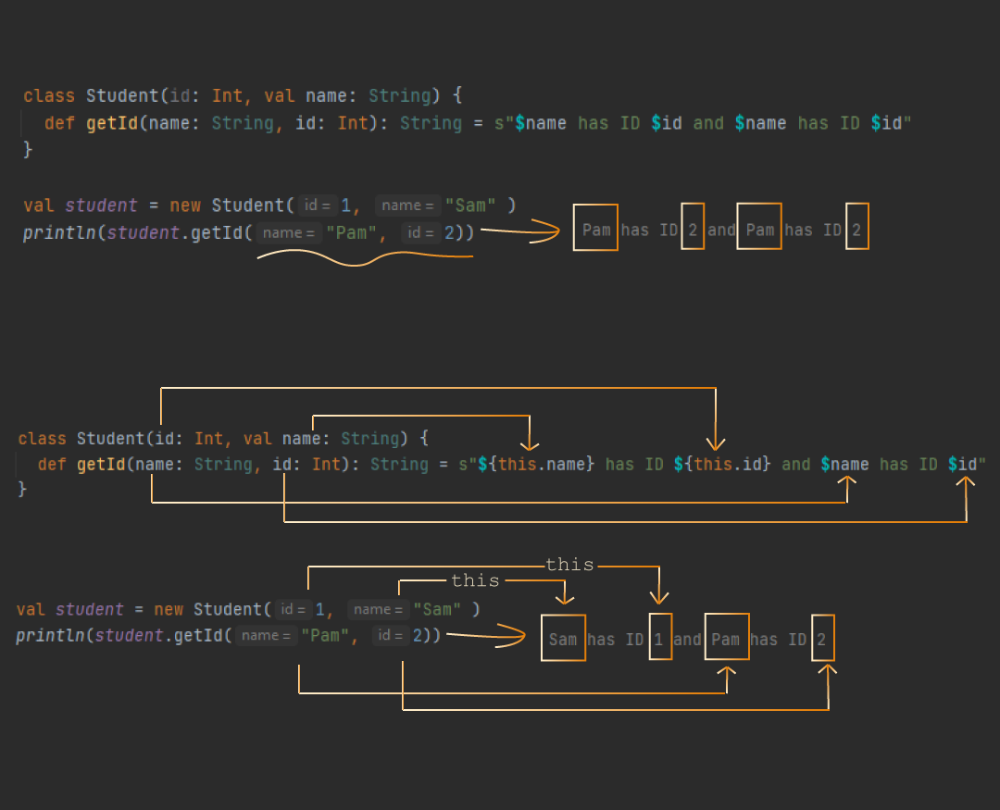

Класс
Если все упростить, то класс можно рассматривать как чертеж.

Смотрите: вы сделали чертеж автомобиля. И теперь хотите получить его материальное воплощение. Для этого вы обращаетесь на завод, где по вашим чертежам и с заданными параметрами(цвет, количество дверей и тд) строится реальный объект - экземпляр вашего класса. Причем функционал созданного вами экземпляра определяется описанными в классе методами.

Если посмотреть на код, то класс объявляется с помощью ключевого слова class, за которым следует имя класса:

``class Student``

Созданиие экземпляра класса происходит при содействии ключевого слова new

``val student = new Student``

Тут все довольно просто. Так что давайте немного усложним наш класс Student - все-таки обычно у студента есть имя, да и свой id бы неплохо было иметь.

**Конструктор класса**

Если посмотреть на то, как мы задаем параметры в классе, то увидим, насколько это похоже на синтаксис функций.

Синтаксис-то похож, но смысл разный. В случае класса вот эту часть ``Student(id: Int, val name: String)`` мы называем конструктором.
Конструктор говорит, что каждый экземпляр класса должен обладать именем и id. Чтобы доступ к атрибутам сделать возможным - необходимо добавить ключевое слово val или var,
прописав его перед параметром. Тогда мы получим поле класса, к которому можно при необходимости обратиться. Параметры класса, объявленные без val/var,  доступны только внутри класса, снаружи к ним доступа нет.

**Тело класса**

Тело класса описываем в фигурных скобках (как и блоки кода). Ко всему, что мы определяем в теле класса, можно получить доступ через точку.
При создании экземпляра класса автоматически исполняются все конструкции, описанные внутри класса.

Методы класса
Для вызова метода также применяется точечная нотация.

Ключевой момент, который вам стоит запомнить - это то, как использование ключевого слова ``this`` влияет на результат программы. This это то же самое, что self в питоне.


**Перегрузка метода(Overloading)**

Позволяет иметь функции с одинаковым названием.

Единственное условие - чтобы набор аргументов  и(или) их тип был разный, чтобы компилятор мог понять, вызов какой именно функции вам требуется.

**Перегруженные конструкторы**

Класс может иметь несколько конструкторов. Это достигается за счет использования def this. Допустим, нам нужен конструктор, который бы по умолчанию использовал 0 в качестве значения id


Объект
Создание объекта очень напоминает создание класса только с ключевым словом object.


**object Number**


Закономерный вопрос - а зачем это надо?

Так вот, может статься, что потребуется создать переменные или методы, доступные в любое время, причем без дополнительного объявления экземпляров класса (что-то такое универсальное).

Например, следующий код позволит нам без особых усилий использовать заданное число Pi в любом месте нашего кода.

``
object Number {
val Pi = 3.14
}``

**Объекты vs Классы**

Отличительно чертой объектов является то, что они:
 - не имеют параметров;
 - являются одиночками (Singleton Object);

 Когда мы говорим "одиночки" мы подразумеваем, что объекты существуют в единственном экземпляре. Можно, кстати, еще добавить, что у них свой тип (например, наш объект Number, взятый в качестве примера, типа Number)

```
val numA = Number
val numB = Number
println(numA == numB) // выведет true
 ```

True, выведенное в результате, свидетельствует о том, что numA и  numB ссылаются на один и тот же  Number.
А вот если подобный эксперимент провести для класса, то результат будет отрицательным, т.к. теперь дело будем иметь с двумя разными экземплярами класса.
```
  class Number   
 
  val numA = new Number
  val numB = new Number

  println(numA == numB) // выведет false

```